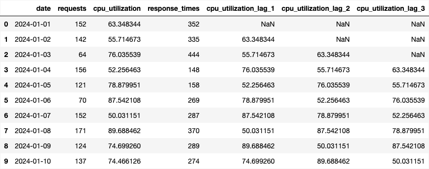
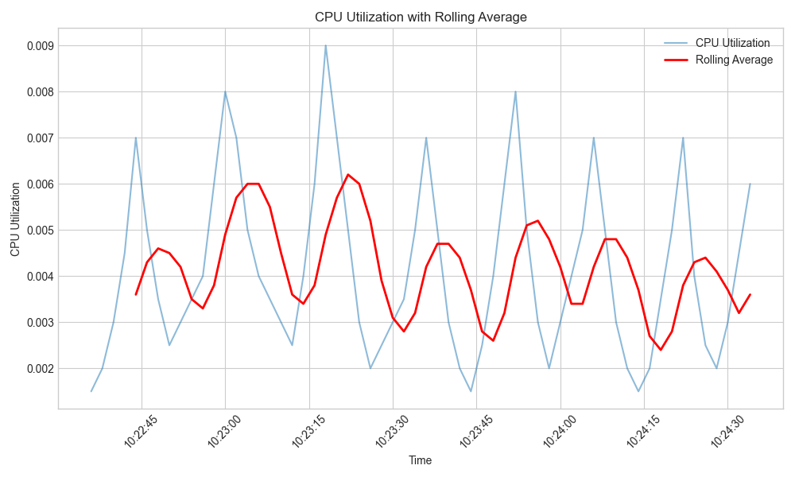
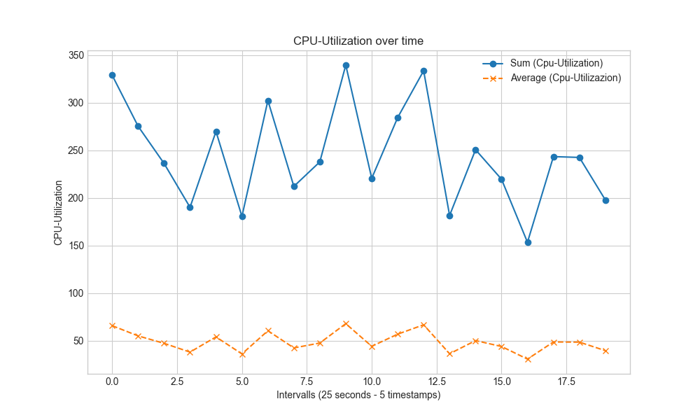
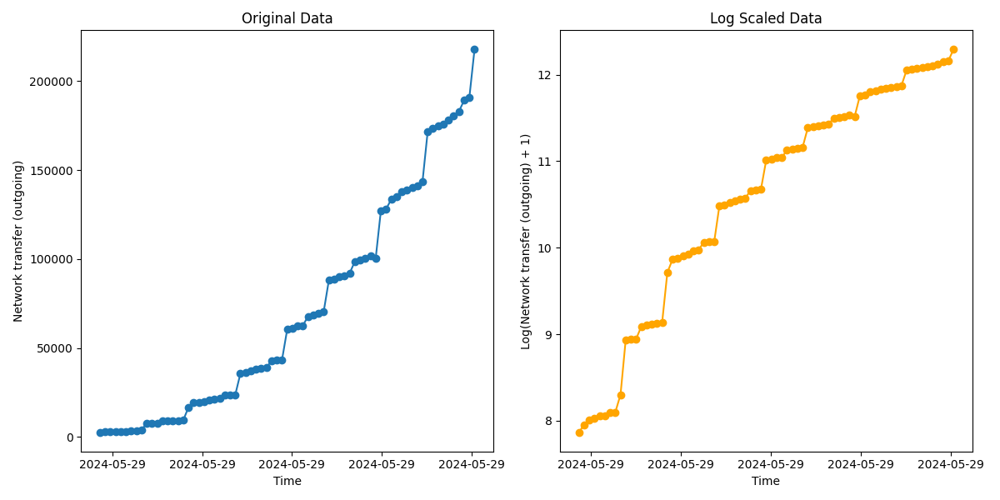
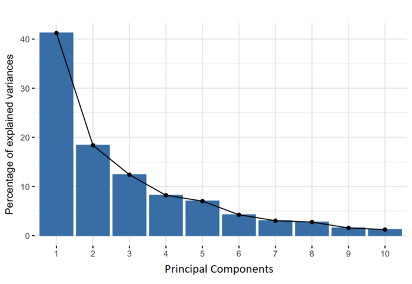

# This is a quick overview on all preprocessing steps that have to be performed on the data

to get a overview on how we preprocesssed the data before putting it into the machine learning models go to:
[script](/src/app/preparator_strategy.py)

## 1. Merge timeseries of all scenarios

As we had many different scenarios set up in the beginning we began by checking if all were compatible to merge 

Code for this step can be found under [code](https://github.com/SimonUlu/performance-prediction/blob/main/src/app/preprocessors/csv_processor.py)

## 2. Preprocess the data

Then the real preprocessing had to be performed. According to our thesis we have identified the following steps to be critical to our prediction. Every single step will be introduced in the following. 

The full code can be found under [code](../../src/app/preprocessors/preprocessor.py)

### a. Adding Lag

```sh
def add_lags(self, columns, num_past_timestamps):
        for column in columns:
            for lag in range(1, num_past_timestamps + 1):
                self.data[f'{column}_lag_{lag}'] = self.data[column].shift(lag)
```




### b. Adding Rolling Averages

```sh
def add_rolling_average(self, columns, window_size):
        for column in columns:
            self.data[f'{column}_rolling_avg_{window_size}'] = self.data[column].rolling(window=window_size).mean()
```



### c. Adding sums over a certain timespan

```sh
def add_sums(self, column_groups):
        for i, column_names in enumerate(column_groups, start=1):
            self.data[f'sum_of_group_{i}'] = self.data[column_names].sum(axis=1)
```



### Log Scaling

```sh
def log_scale(self, columns):
    for column in columns:
        self.data[f'{column}_log_scaled'] = np.log1p(self.data[column])
```



### Normalization

```sh
def normalize(self, columns):
        scaler = MinMaxScaler()
        for column in columns:
            self.data[f'{column}_normalized'] = scaler.fit_transform(self.data[[column]]) 
```

### Standardization

```sh
def standardize(self, columns):
        scaler = StandardScaler()
        for column in columns:
            self.data[f'{column}_standardized'] = scaler.fit_transform(self.data[[column]])
```

### Feature Selection




